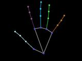
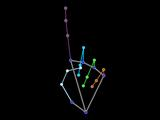
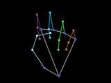
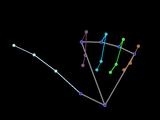
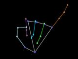
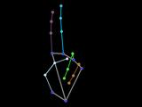
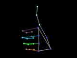
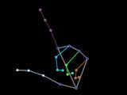
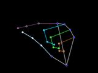

# GestureController
An application that recognizes gestures using a webcam and allows you to control your computer using gestures.

Authors: Lvov Andrey, Baryshev Andrey

---


## Usage

---
### Install python 3.9  
https://www.python.org/downloads/release/python-390/

### Install dependencies
```shell
pip install kivy opencv-python torch pyautogui numpy mediapipe pillow
```

### Run app
```shell
python src\app\app.py
```

---
### Camera action group
*Open* - turn camera on.

*Close* - turn camera off.

*Change* - switch to another camera

*Show camera* - turn on/off camera displaying

### Hands action group

*Show hands* - turn on/off hand landmarks displaying

### Gesture control action group

*Show gesture* - turn on/off recognised gesture displaying

---
## Gestures

0: Open palm  
Action: Open / close task bar  


1: Index finger up  
Action: Left mouse button click  


2: Fist  
Action: None  


3: Thumb aside  
Action: Go to the previous tab (ctrl + shift + tab or left arrow if task bar is opened)  


4: Pinky aside  
Action: Go to the next tab (ctrl + tab or right arrow if task bar is opened)  


5: Index and middle fingers up  
Action: Cursor control  


6: Thumb up  
Action: None  


7: Thumb and index fingers separated  
Action: None  


8: Thumb and index fingers together  
Action: None  

